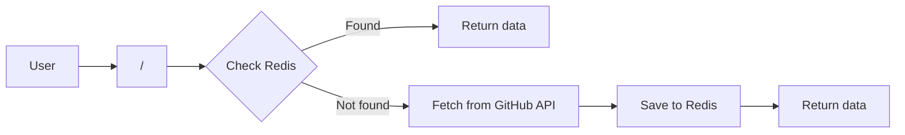

# Kubernetes Express API example

[](https://github.com/terotuomala/k8s-express-api-example/actions)
[](https://github.com/terotuomala/k8s-express-api-example/actions)
[](https://github.com/terotuomala/k8s-express-api-example/actions)

> :information_source: This project is a part of [GitOps workflow example using Flux2](https://github.com/terotuomala/gitops-flux2-example) which includes Kubernetes manifests for Redis and NGINX Ingress Controller as well as handles Continuous Delivery.

A simple example REST API Application using Node.js + Express.js + Redis running in Kubernetes.

<!-- TABLE OF CONTENTS -->
## Table of Contents
* [Overview](#mag-overview)
  * [Endpoints](#endpoints)
* [Features](#rocket-features)
  * [Dockerfile optimization](#dockerfile-optimization)
  * [SHA256 digest pinned Docker image tags](#sha256-digest-pinned-docker-images)
  * [Docker image and npm dependency updates](#docker-image-and-npm-dependency-updates)
  * [Vulnerability scanning](#vulnerability-scanning)
  * [Graceful shutdown](#graceful-shutdown)
* [Kustomize configuration](#kustomize-configuration)
* [Local development](#keyboard-local-development)

<!-- OVERVIEW -->
## :mag: Overview
In a nutshell the application is used as a proxy for fetching most starred GitHub repositories.

A simplified usage flow of the data fetching and Redis cache usage:



<!-- ENDPOINTS -->
### Endpoints
The application serves the following endpoints:

| Method | Path  | Description |
|:-------|:------|:-------------|
| GET | / | Returns 30 most starred GitHub repositories as JSON |
| GET | /readyz | Readiness status used by Kubernetes readiness probe |
| GET | /livez  | Liveness status used by Kubernetes liveness probe |

<!-- FEATURES -->
## :rocket: Features
- Optimized Dockerfile using multi-stage builds
- SHA256 digest pinned Docker images with automated update using [Renovate](https://docs.renovatebot.com)
- Automated vulnerability scan of the Docker image and npm dependencies using [Trivy](https://github.com/aquasecurity/trivy)
- YAML validation using [yamllint](https://github.com/adrienverge/yamllint)
- JavaScript validation using [ESLint](https://eslint.org)
- Graceful shutdown and health checks (readiness and liveness) using [Terminus](https://github.com/godaddy/terminus)
- Structured JSON logging using [Pino](https://github.com/pinojs/pino)
- Kubernetes configuration customization using [Kustomize](https://github.com/kubernetes-sigs/kustomize)
- Network traffic flow control using [Network Policies](https://kubernetes.io/docs/concepts/services-networking/network-policies/)

### Dockerfile optimization
- In order to keep the Docker image size optimal a multi-stage builds is used
- The npm dependencies (without `devDependencies`) are installed in a `build` stage
- Only the nessecary things (`node_modules` and the application code) are copied from the `build` state to `release` stage in order to have minimum amount of layers
- Only the layers from the `release` stage are pushed when the Docker image is build

### SHA256 digest pinned Docker images
SHA256 digest pinning is used to achieve reliable and reproducable builds. Using digest as the image's primary identifier instead of using a tag makes sure that specific version of the image is used.

### Docker image and npm dependency updates
In order to receive Docker image and npm dependency updates [Renovate](https://docs.renovatebot.com) is used to create a pull request when: 

- Newer digest from [chainguard/node-lts](https://hub.docker.com/r/chainguard/node-lts/tags) is available on Docker Hub 
- `Minor` or `Patch` update of a npm dependency is available 

### Vulnerability scanning
In order to regularly scan Docker image and npm dependencies for vulnerabilities a scheduled [job](https://github.com/terotuomala/k8s-express-api-example/blob/main/.github/workflows/vulnerability-scan.yml) is used to build the Docker image and scan it's content using [Trivy](https://github.com/aquasecurity/trivy).

### Graceful shutdown
In order to gracefully shutdown the `node` process it must: 

- Receive [Termination Signals](https://www.gnu.org/software/libc/manual/html_node/Termination-Signals.html) e.g. `SIGTERM` and `SIGINT`
- Be able to handle the Signals

To achieve this:

- The Docker image `CMD` instructions uses [exec form](https://docs.docker.com/engine/reference/builder/#cmd) `["node", "src/index.js"]` which does not invoke a command shell `/bin/sh -c, node, src/index.js` 
- Instead it just replaces the command shell with the command to be executed `node src/index.js`. This makes sure that the `node` process is spawned as PID 1.
- [Terminus](https://github.com/godaddy/terminus) is used to handle the `SIGTERM` and `SIGINT` Signals

## Kustomize configuration
Kustomize configuration is based on [Directory Structure Based Layout](https://kubectl.docs.kubernetes.io/pages/app_composition_and_deployment/structure_directories.html) in order to be able to use multiple environments with different configuration.

```sh
📁 k8s
├── 📁 base
│   ├── deployment.yaml
│   ├── hpa.yaml
│   ├── ingress.yaml
│   ├── kustomization.yaml
│   ├── netpol-egress.yaml
│   ├── netpol-ingress.yaml
│   ├── pdb.yaml
│   └── service.yaml
└── 📁 staging
    ├── hpa-patch.yaml
    ├── kustomization.yaml
    ├── namespace.yaml
    └── pdb-patch.yaml
```

<!-- LOCAL DEVELOPMENT -->
## :keyboard: Local development
Start the redis container:
```sh
docker run -d --rm --name redis -p 6379:6379 redis:7-alpine
```

Start the nodemon tool which automatically restarts the node application when file changes in the directory are detected:
```sh
npm run dev
```
